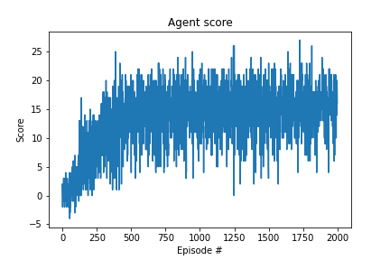

## Algorithm

Agent is implemented as a deep Q-learning (DQN) agent with experience replay. DQN algorithm takes the environment state as a input to a deep neural network and output an approximated Q-value for each action in the action space. DQNs differ from Q-learning 

The Q-value is approximated with two identical neural networks. Each network contains **two fully connected dense layers with 128 neurons and Relu activations\.** The final dense layer contains 4 neuron representing each of the actions available to the agent. 

## Result

Agent consistently solves the challenge after approximately 700 episodes. 

## Hyperparameters

| Parameter          | Description                                                  | Value  |
| ------------------ | ------------------------------------------------------------ | ------ |
| batch_size         | Number of prior episodes used to update target network.      | 64     |
| target_update_step | Number of steps agent takes before updating the target network. | 4      |
| gamma              | Discount rate of future value estimates.                     | 0.99   |
| epsilon            | Controls how requently the agent selects a random action instead of the action with the max Q-value. | 1.0    |
| tau                | Rate of averaging policy network and target network weights. | 0.001  |
| learning_rate      |                                                              | 0.0005 |

## Improvement ideas

Implementing prioritized experience replay will help the agent learn from infrequent exerpiences better. Additionally, using double deep Q-learning to independantly select an action and evaluate the action will reduce over estimation.